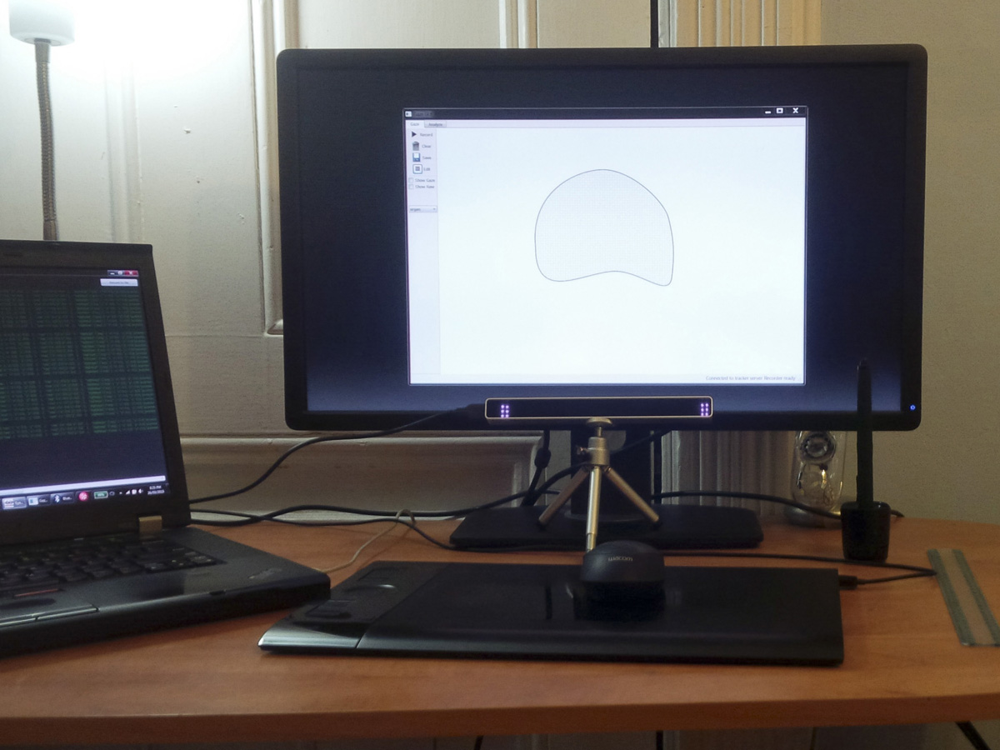

# gazecontour

This software was written to explore how gaze input can be used to delineate curves (contours) on medical images.
It provides a GUI to capture gaze data, analyze it visually, and evaluate the effect of different processing algorithms.

The GUI showing a visualization of previously captured gaze data.

The software works with the [Eye Tribe Tracker](http://theeyetribe.com).
It has been tested only on Windows, but as it uses the cross-platform Qt framework, it should work on other systems supported by the Tracker.
Note this software is research only: bugs may exist and error-handling is lacking.
Most changes are meant to be made directly in the source code.

## GUI overview
The GUI has two tabs: the Gaze tab and the Analyze tab.

### Gaze tab

This tab is used to display and capture gaze position data from the Eye Tribe tracker. It should be used while the Eye Tribe Server is running. The status bar at the bottom right of the window displays the current tracker status (connected, not connected), and the number of frames recorded.

The large central area is used to show stimuli and draw contours. Contours are drawn by holding down the mouse button while gazing.

The main actions for this tab are found as buttons in the left-hand toolbar. They are:

* **Record**: Toggle recording of gaze data to memory (shortcut: R).
* **Clear**: Erase any data in the recorder's memory (shortcut: Ctrl+N).
* **Save**: Save to an Excel file  (.xlsx) (shortcut: Ctrl+S).
* **Edit**: Toggle recording of gaze data to memory. (shortcut: Space)

Beneath this there are also several options:

* **Show gaze**: Show raw and averaged gaze position as dots on the screen (useful to confirm calibration but usually distracting).
* **Show raw**: Show the raw paths collected instead of fitted curves.
* **Stimulus (dropdown)**: Select a stimulus shape (e.g. circle, line) to display.

### Analyze tab

This tab, pictured at top, provides tools to quickly inspect previously recorded gaze data.

The central widget shows two plots: an X-Y plot showing position data over a given time interval, and a position-time plot showing only the x component of motion. Beneath them is a slider allowing selection of the time start- and end-points by moving or resizing the blue region. This slider is overlaid on a speed vs. time plot, and can be zoomed like the others.

The toolbar items are:
* **Load rec.**: Load data directly from the recorder memory (i.e., anything just captured in the Gaze tab).
* **Load file**: Load data from an .xlsx file
* **Checkboxes**: Toggle the following plots:
    * Raw: raw gaze position (average of both eyes)
    * Avg: time-averaged gaze position provided by the tracker
    * Cursor: mouse cursor position
    * Stim: the stimulus image
    * Fix: smoothed fixation position (using the algorithm)
* **Play, Pause, Stop**: scrubs the time slider along in real time. Stop returns the start of the slider to 0.

##Implementation details
The GUI is implemented in Python, using the [PySide](http://wiki.qt.io/Pyside) bindings for the Qt UI framework.
Calculations and fits are assisted by [SciPy](http://www.scipy.org/) packages.
Interactive plots are generated by [PyQtGraph](http://pyqtgraph.org/).

All program code was written by the author except, as indicated in the source code:
a B-Spline-to-Bézier conversion function (Zachary Pincus, [src](http://mail.scipy.org/pipermail/scipy-dev/2007-February/006651.html)),
and Bézier fitting code (Andy Finnell, [src](http://losingfight.com/blog/2011/05/31/how-to-implement-a-vector-brush/)) (ported to Python from Objective-C). 

## Experimental setup

The software in use with an Eye Tribe Tracker.

